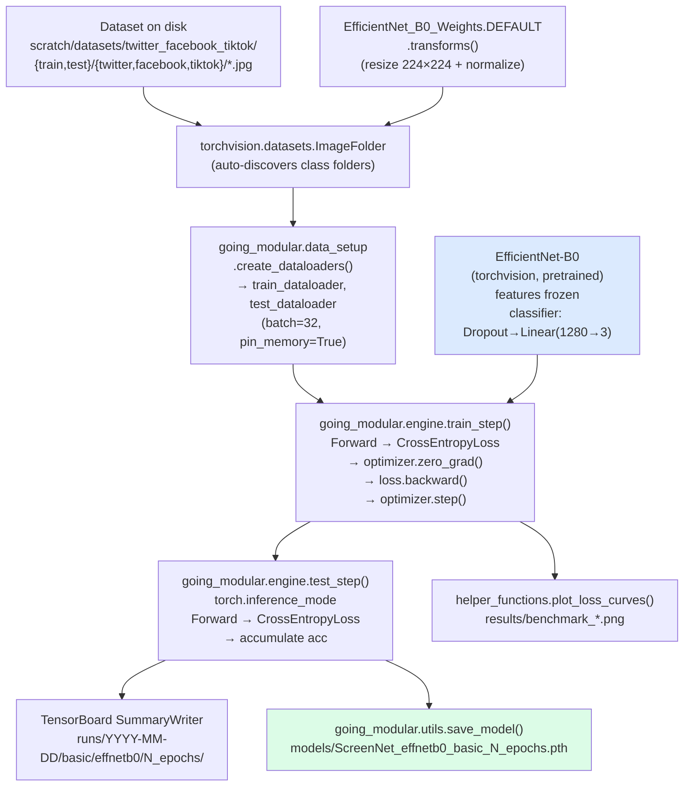
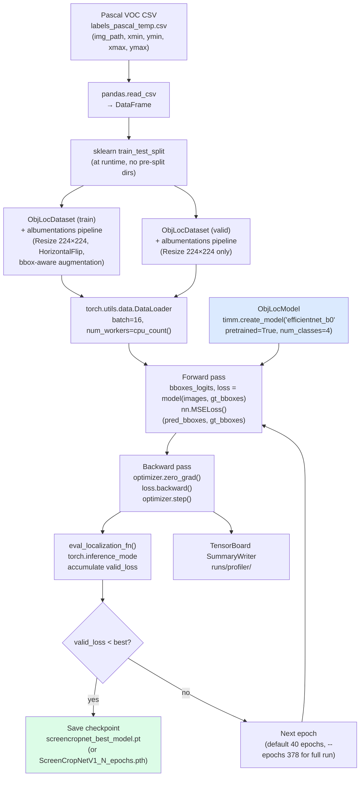
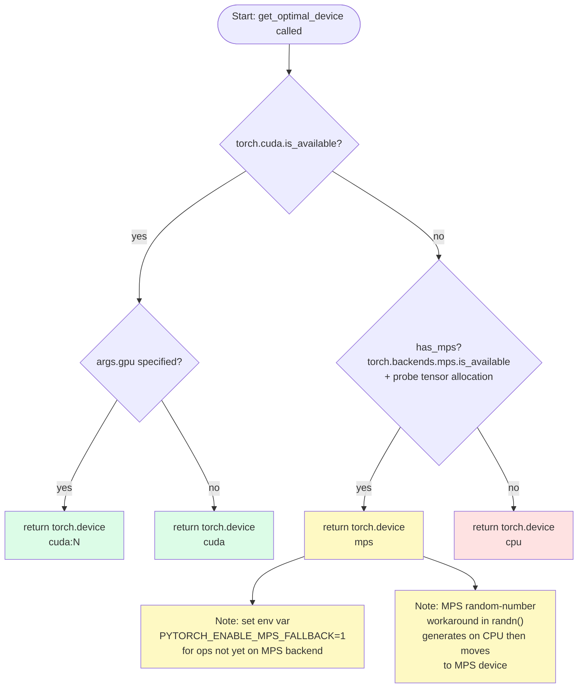
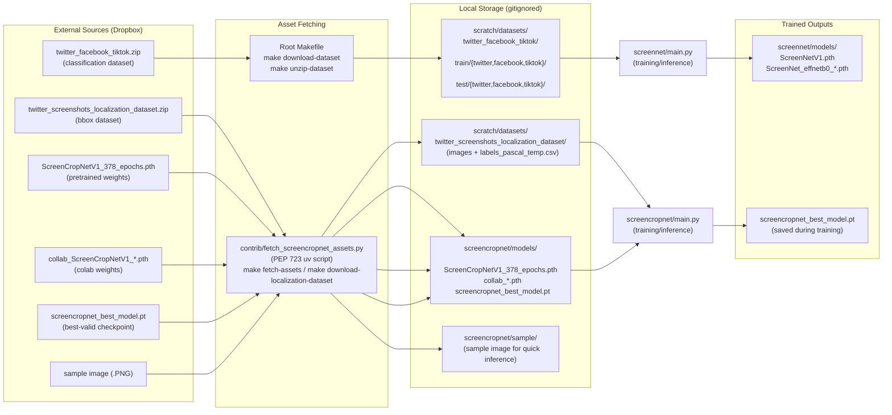

# Architecture: pytorch-lab

## Table of Contents

1. [System Overview](#1-system-overview)
2. [High-Level Component Diagram](#2-high-level-component-diagram)
3. [Subproject Deep Dives](#3-subproject-deep-dives)
   - 3.1 [screennet — Image Classification](#31-screennet--image-classification)
   - 3.2 [screencropnet — Bounding-Box Localization](#32-screencropnet--bounding-box-localization)
4. [Training Pipeline Diagrams](#4-training-pipeline-diagrams)
   - 4.1 [screennet Training Pipeline](#41-screennet-training-pipeline)
   - 4.2 [screencropnet Training Pipeline](#42-screencropnet-training-pipeline)
5. [Device-Selection Flow](#5-device-selection-flow)
6. [Data and Asset Flow](#6-data-and-asset-flow)
7. [Component Responsibilities Table](#7-component-responsibilities-table)
8. [Operational and Scalability Notes](#8-operational-and-scalability-notes)

---

## 1. System Overview

**pytorch-lab** is a local ML experimentation repository built around
[Daniel Bourke's PyTorch deep-learning course](https://github.com/mrdbourke/pytorch-deep-learning).
It is **not** a web service. There are no REST endpoints, no FastAPI, no
microservices, and no network-facing processes. Everything runs as local CLI
commands and Python scripts on a single Mac (Apple Silicon, macOS 12.3+).

The repository houses **two independent model subprojects** that solve different
computer-vision tasks on the same corpus of social-media screenshots:

| Subproject | Task | Model family | Loss |
|---|---|---|---|
| `screennet/` | Image classification (3 classes: twitter / facebook / tiktok) | EfficientNet-B0 (torchvision) | CrossEntropyLoss |
| `screencropnet/` | Bounding-box localization (single crop per image) | EfficientNet-B0 (timm, 4-output head) | MSELoss |

Both subprojects share common training infrastructure through the installed
`going_modular` package and the root `helper_functions.py` module. They do
**not** share a database, a model registry, or a runtime process.

### Why two standalone subprojects?

The subprojects are intentionally isolated so that each can be developed,
trained, and deployed independently without affecting the other. They duplicate
`devices.py` and `errors.py` rather than importing a common copy. This is a
deliberate trade-off: it keeps each subproject self-contained and avoids the
need for a shared internal library that would couple their release cycles.

---

## 2. High-Level Component Diagram

```mermaid
graph TB
    subgraph repo["pytorch-lab (repo root)"]
        direction TB
        HF["helper_functions.py\n(plot helpers, walk_through_dir)"]
        GM["going_modular package\n(going_modular/going_modular/)"]
        TASKS["tasks/\n(Invoke CLI: local + ci namespaces)"]
        MAKE["Root Makefile\n(env, dataset, quality gates)"]
        PYPROJECT["pyproject.toml\n(uv lock, ruff, pyright, pytest)"]
    end

    subgraph SN["screennet/"]
        SN_MAIN["main.py\n(argparse entry point)"]
        SN_DEV["devices.py\n(get_optimal_device)"]
        SN_ERR["errors.py"]
        SN_MAKE["Makefile\n(train / predict / worst-first)"]
        SN_MODEL["EfficientNet-B0\n(torchvision, frozen features\n+ custom classifier head)"]
    end

    subgraph SCN["screencropnet/"]
        SCN_MAIN["main.py\n(argparse entry point)"]
        SCN_ARCH["arch.py → ObjLocModel\n(timm EfficientNet-B0, 4 outputs)"]
        SCN_DATA["data_set.py → ObjLocDataset\n(Pascal VOC CSV + albumentations)"]
        SCN_HELP["helpers.py\n(IoU, NMS, mAP)"]
        SCN_TYPES["ml_types.py\n(ImageNdarrayBGR/HWC, TensorCHW)"]
        SCN_DEV["devices.py\n(get_optimal_device)"]
        SCN_ERR["errors.py"]
        SCN_MAKE["Makefile\n(train / autocrop / get-best-model)"]
    end

    subgraph DATA["Data / Assets (gitignored)"]
        D1["scratch/datasets/\ntwitter_facebook_tiktok/\n(classification dataset)"]
        D2["scratch/datasets/\ntwitter_screenshots_localization_dataset/\n(bbox dataset, Pascal VOC CSV)"]
        D3["screencropnet/models/\n(.pth / .pt checkpoints)"]
    end

    subgraph CONTRIB["contrib/"]
        FETCH["fetch_screencropnet_assets.py\n(PEP 723 idempotent fetcher)"]
        ISMPS["is-mps-available.py"]
        MPLCHECK["does-matplotlib-work.py"]
    end

    GM --> SN_MAIN
    GM --> SCN_MAIN
    HF --> SN_MAIN
    SN_DEV --> SN_MAIN
    SCN_DEV --> SCN_MAIN
    SCN_ARCH --> SCN_MAIN
    SCN_DATA --> SCN_MAIN
    SCN_HELP --> SCN_MAIN

    FETCH --> D2
    FETCH --> D3

    MAKE --> CONTRIB
    MAKE --> D1
    MAKE --> D2

    TASKS --> MAKE
    PYPROJECT --> GM
```



---

## 3. Subproject Deep Dives

### 3.1 screennet — Image Classification

**Task.** Given a screenshot, predict which platform it came from: Twitter,
Facebook, or TikTok (3-class softmax classification).

**Model.** `torchvision.models.efficientnet_b0` loaded with `DEFAULT`
pretrained weights. All parameters in the `features` block are frozen
(`requires_grad = False`). The `classifier` is replaced with:

```
Dropout(p=0.2) → Linear(1280 → 3)
```

The transforms come directly from `EfficientNet_B0_Weights.DEFAULT.transforms()`,
which handles resize and normalization automatically.

**Entry point.** `screennet/main.py` is a monolithic script that handles:
- Argument parsing (`argparse`) — epochs, batch-size, LR, seed, checkpoint resume,
  predict, test, worst-first ranking, summary, and more.
- Data loading via `going_modular.data_setup.create_dataloaders` (ImageFolder).
- Training via `going_modular.engine.train` (which writes to TensorBoard).
- Inference and prediction-result CSV export.
- Confusion matrix computation (mlxtend).
- Model serialization to `screennet/models/` via `going_modular.utils.save_model`.

**Loss and optimizer.** `nn.CrossEntropyLoss` + `torch.optim.Adam(lr=0.001)`.
Default training run is 10 epochs with batch size 32.

**Device selection.** `screennet/devices.py::get_optimal_device` — see
[section 5](#5-device-selection-flow) for the full flowchart.

**Key files:**

```
screennet/
├── main.py          # monolithic entry point (2 100+ lines)
├── devices.py       # get_optimal_device, seed_everything, mps helpers
├── errors.py        # run(code, task) — safe module-level side-effect guard
└── Makefile         # train / predict / worst-first / tensorboard
```

---

### 3.2 screencropnet — Bounding-Box Localization

**Task.** Given a screenshot, predict the bounding box (xmin, ymin, xmax, ymax)
of the "content crop" region as a single regression problem.

**Model — `ObjLocModel` (`screencropnet/arch.py`).**

```python
class ObjLocModel(nn.Module):
    def __init__(self, pretrained=True):
        self.backbone = timm.create_model(
            "efficientnet_b0", pretrained=pretrained, num_classes=4
        )

    def forward(self, images, gt_bboxes=None):
        bboxes_logits = self.backbone(images)   # shape: (B, 4)
        if gt_bboxes is not None:
            loss = nn.MSELoss()(bboxes_logits, gt_bboxes)
            return bboxes_logits, loss
        return bboxes_logits
```

The `timm` model replaces the standard classification head with a 4-unit
linear output. MSELoss measures pixel-coordinate regression error directly.
No anchor boxes, no NMS at training time.

**Dataset — `ObjLocDataset` (`screencropnet/data_set.py`).**

Reads a Pascal VOC-style CSV with columns `img_path`, `xmin`, `ymin`, `xmax`,
`ymax`. Each `__getitem__` call:
1. Reads the image with OpenCV (`cv2.imread`), converts BGR → RGB.
2. Applies an `albumentations` pipeline that handles both pixel and bounding-box
   augmentation jointly.
3. Converts the NumPy array to a `TensorCHW` float by `permute(2,0,1) / 255.0`.
4. Returns `(img_tensor: TensorCHW, bbox_tensor: Tensor[4])`.

Images are resized to 224 × 224 during the albumentations transform.

**Dataset split.** `screencropnet/main.py` uses `sklearn.model_selection.train_test_split`
to split the CSV dataframe at runtime; there is no pre-split directory structure
unlike the classification task.

**Localization training loop — `going_modular.engine`.**

Two dedicated functions handle the localization task (as opposed to the
classification `train_step`/`test_step`):

- `train_localization_fn` — one epoch forward+backward with profiling.
- `eval_localization_fn` — one epoch inference with `torch.inference_mode`.
- `train_localization` — outer loop over epochs, tracks `best_valid_loss`,
  saves checkpoint to `screencropnet_best_model.pt` on improvement, logs to
  TensorBoard.

**IoU and detection utilities — `screencropnet/helpers.py`.**

Implements evaluation metrics that are **used during development and
evaluation, not during training loss computation**:
- `find_intersection`, `find_jaccard_overlap` — tensor-based IoU.
- `intersection_over_union` — supports midpoint or corner box formats.
- `non_max_suppression` — NMS on a list of scored boxes.
- `mean_average_precision` — full mAP calculation.

**Provenance — YOLOv3 lineage.** `iou_width_height`,
`intersection_over_union`, `non_max_suppression`, and
`mean_average_precision` are ported from the Kaggle
[*YOLOv3 for Pascal VOC*](https://www.kaggle.com/code/dqhdqmcttdqx/yolov3-for-pascal-voc/notebook)
notebook (see the `# SOURCE:` comment at `screencropnet/helpers.py:59`);
`find_intersection` / `find_jaccard_overlap` come separately from sgrvinod's
*a-PyTorch-Tutorial-to-Object-Detection* (`helpers.py:10`). This is a
**YOLOv3-derived evaluation/post-processing utility layer only** — the
`ObjLocModel` above is a single-box EfficientNet-B0 regressor (MSELoss; no
anchors, grid cells, objectness, or Darknet backbone), not a full YOLO
network.

**Type aliases — `screencropnet/ml_types.py`.**

```python
ImageNdarrayBGR = NewType("ImageBGR", np.ndarray)   # raw OpenCV output
ImageNdarrayHWC = NewType("ImageHWC", np.ndarray)   # after BGR→RGB
TensorCHW      = NewType("TensorCHW", torch.Tensor) # after permute + normalize
```

These enforce layout semantics at type-check time (pyright) without runtime cost.

**Inference modes.** `screencropnet/main.py` supports `--predict` (single
image, draws bbox overlay), `--autocrop` (crops the screenshot to the
predicted bbox, optionally resize with pillarboxing), and `--test` (batch
evaluation).

**Key files:**

```
screencropnet/
├── main.py          # entry point: train / predict / autocrop / evaluate
├── arch.py          # ObjLocModel (timm EfficientNet-B0, 4-output regression)
├── data_set.py      # ObjLocDataset (Pascal VOC CSV + albumentations)
├── helpers.py       # IoU, NMS, mAP utilities
├── ml_types.py      # typed ndarray/tensor aliases
├── devices.py       # get_optimal_device (copy of screennet/devices.py)
├── errors.py        # run() helper (copy of screennet/errors.py)
└── Makefile         # train / train_100 / transfer_learning / autocrop / get-best-model
```

---

## 4. Training Pipeline Diagrams

### 4.1 screennet Training Pipeline



### 4.2 screencropnet Training Pipeline



---

## 5. Device-Selection Flow

Both `screennet/devices.py` and `screencropnet/devices.py` contain identical
implementations of `get_optimal_device`. The selection runs at module import
time via `enable_tf32()` (which is guarded by `errors.run`) and again
explicitly when `get_optimal_device(args)` is called from `main()`.



**MPS-specific workarounds present in `devices.py`:**

- `randn(seed, shape)`: On MPS, random tensors are generated on CPU with a
  seeded `torch.Generator`, then moved to the MPS device. This works around
  a PyTorch bug where MPS does not handle randomness correctly
  ([#77988](https://github.com/pytorch/pytorch/issues/77988)).
- `mps_contiguous(tensor, device)`: Calls `.contiguous()` only on MPS to
  avoid stride-related errors
  ([#79383](https://github.com/pytorch/pytorch/issues/79383)).
- `autocast()`: On MPS/CPU, returns `contextlib.nullcontext()` since
  `torch.autocast("cuda")` is a no-op outside CUDA.
- `enable_tf32()`: Only activates on CUDA; harmless on MPS/CPU.

---

## 6. Data and Asset Flow



**Idempotency.** `fetch_screencropnet_assets.py` checks whether the target
path already exists before downloading. Re-running `make fetch-assets` is
safe and skips already-present files.

---

## 7. Component Responsibilities Table

| Component | Purpose | Key Files | Depends On |
|---|---|---|---|
| `screennet/main.py` | Classification entry point: train, predict, evaluate, confusion matrix | `screennet/main.py` | `going_modular`, `helper_functions`, `screennet.devices`, `torchvision` |
| `screencropnet/main.py` | Localization entry point: train, predict, autocrop, evaluate | `screencropnet/main.py` | `going_modular`, `screencropnet.{arch,data_set,devices}`, `albumentations`, `timm` |
| `ObjLocModel` | EfficientNet-B0 backbone with 4-output regression head (timm) | `screencropnet/arch.py` | `timm`, `torch` |
| `ObjLocDataset` | Pascal VOC CSV loader with albumentations bbox augmentation | `screencropnet/data_set.py` | `pandas`, `cv2`, `albumentations`, `screencropnet.ml_types` |
| `going_modular.engine` | Training/test steps, localization loops, TensorBoard integration, torch profiler | `going_modular/going_modular/engine.py` | `torch`, `tensorboard`, `tqdm` |
| `going_modular.data_setup` | Creates `ImageFolder`-backed DataLoaders for classification | `going_modular/going_modular/data_setup.py` | `torchvision`, `torch` |
| `going_modular.model_builder` | TinyVGG reference model (used in notebooks/exercises, not in production training) | `going_modular/going_modular/model_builder.py` | `torch` |
| `going_modular.utils` | `save_model` (writes `.pth` state dict to disk) | `going_modular/going_modular/utils.py` | `torch` |
| `going_modular.predictions` | `pred_and_plot_image` (single-image inference + matplotlib display) | `going_modular/going_modular/predictions.py` | `torch`, `torchvision`, `PIL`, `matplotlib` |
| `helper_functions.py` | Plotting utilities: `plot_loss_curves`, `plot_decision_boundary`, `plot_predictions` | `helper_functions.py` | `torch`, `matplotlib`, `numpy` |
| `screencropnet/helpers.py` | IoU, NMS, mAP evaluation metrics | `screencropnet/helpers.py` | `torch`, `tqdm` |
| `screencropnet/ml_types.py` | Typed ndarray/tensor aliases for static analysis | `screencropnet/ml_types.py` | `numpy`, `torch` |
| `devices.py` (both) | Device selection (CUDA→MPS→CPU), MPS workarounds, seed utilities | `screennet/devices.py`, `screencropnet/devices.py` | `torch` |
| `errors.py` (both) | Safe side-effect runner: catches exceptions from module-level calls | `screennet/errors.py`, `screencropnet/errors.py` | `sys`, `traceback` |
| `tasks/local.py` | Invoke tasks: `clean`, `sync`, `lock`, `ipython`, `jupyter`, `env_works` | `tasks/local.py` | `invoke` |
| `tasks/ci.py` | Invoke tasks: `lint`, `format`, `typecheck`, `pytest`, `check` | `tasks/ci.py` | `invoke`, `ruff`, `pyright`, `pytest` |
| `contrib/fetch_screencropnet_assets.py` | Idempotent PEP 723 downloader for dataset, checkpoints, sample image | `contrib/fetch_screencropnet_assets.py` | `requests` (inline dep) |
| Root `Makefile` | Top-level convenience targets: env, dataset, quality checks | `Makefile` | `uv`, `curl`, `unzip` |
| `pyproject.toml` | Single source of truth for dependencies (uv lock), ruff, pyright, pytest config, and package layout | `pyproject.toml` | — |

---

## 8. Operational and Scalability Notes

### Mac-Only Constraint

The project is explicitly **Mac-only**. The `pyproject.toml` description and
`CLAUDE.md` both call this out. The standard PyPI PyTorch wheels ship with the
MPS (Metal Performance Shaders) backend included for Apple Silicon; no
alternative pip index is needed. Running on Linux or Windows would require
adjusting torch index URLs and would lose MPS acceleration.

### MPS vs. CUDA

On Apple Silicon, the device chain is MPS (preferred) → CPU (fallback). MPS
has known gaps in op coverage. Set `PYTORCH_ENABLE_MPS_FALLBACK=1` in your
shell to let PyTorch silently fall back individual ops to CPU rather than
crashing. This means some ops in a single forward pass may execute on CPU
while the rest run on GPU silicon — mixed device performance is expected.

### Deliberate Duplication of `devices.py`

`screennet/devices.py` and `screencropnet/devices.py` are byte-for-byte
identical (including the source attribution comment). This is intentional: the
two subprojects are designed to be independently deployable. Extracting a
shared internal package would couple their versioning and introduce an import
dependency that contradicts the standalone design goal.

The same rationale applies to `errors.py`.

### Single-Process, No Distributed Training by Default

`screennet/main.py` includes `torch.distributed` boilerplate and `--world-size`
/ `--rank` arguments inherited from the PyTorch ImageNet reference script, but
the practical default is single-process. MPS does not support NCCL; distributed
training would require switching to CPU or CUDA.

### Checkpoint Strategy

- **screennet** saves the state dict after each full training run; no epoch-level
  checkpoint (no best-model tracking implemented in the main training loop).
- **screencropnet** saves on every validation-loss improvement during
  `train_localization`, producing `screencropnet_best_model.pt`. A
  full-run checkpoint `ScreenCropNetV1_N_epochs.pth` is also saved via
  `going_modular.utils.save_model` at training completion.

### Dataset Layout Differences

- **screennet** uses `torchvision.datasets.ImageFolder` which requires the
  classic `train/{class}/` and `test/{class}/` directory layout. The split is
  pre-determined on disk.
- **screencropnet** uses a flat image directory with a CSV annotation file
  (`labels_pascal_temp.csv`). The train/validation split is computed at runtime
  via `sklearn.model_selection.train_test_split`. This means the exact split
  depends on the random seed; reproducibility requires `--seed` to be set
  consistently (default: 42).

### TensorBoard and Profiler

Both entry points write TensorBoard logs under `runs/`. The `engine.py`
`train_step` and `train_localization_fn` functions wrap every epoch in
`torch.profiler.profile` with `tensorboard_trace_handler`. This produces
detailed CPU/CUDA/memory traces alongside the scalar loss curves. The profiler
schedule uses `wait=1, warmup=1, active=3, repeat=2`, so profiling is active
for batches 2–4 of each epoch pair.

### Quality Gates

All formatting, linting, and type checking are configured solely in the root
`pyproject.toml` — subproject `Makefile`s delegate back to it. The ruff
configuration excludes `tasks/`, `.claude/`, legacy notebooks, and two legacy
root scripts (`label_pointer.py`, `preprocessing_data_loader.py`) from linting
scope. This means those files may contain style violations; cleaning them is a
tracked follow-up per `specs/post-migration-hardening.md`.

### Dependency Management

All runtime and dev dependencies are declared in `pyproject.toml` and locked in
`uv.lock`. The package layout maps:

```
going_modular/going_modular/  →  importable as  going_modular
screennet/                    →  importable as  screennet
screencropnet/                →  importable as  screencropnet
helper_functions.py           →  importable as  helper_functions
```

Installing the project editable (`uv sync`) registers these mappings so that
`from going_modular import engine` works without any `sys.path` manipulation.
